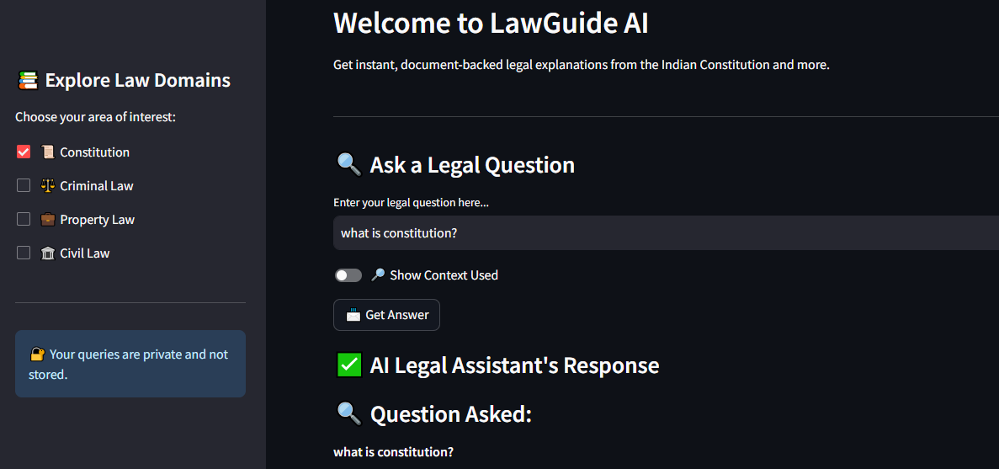
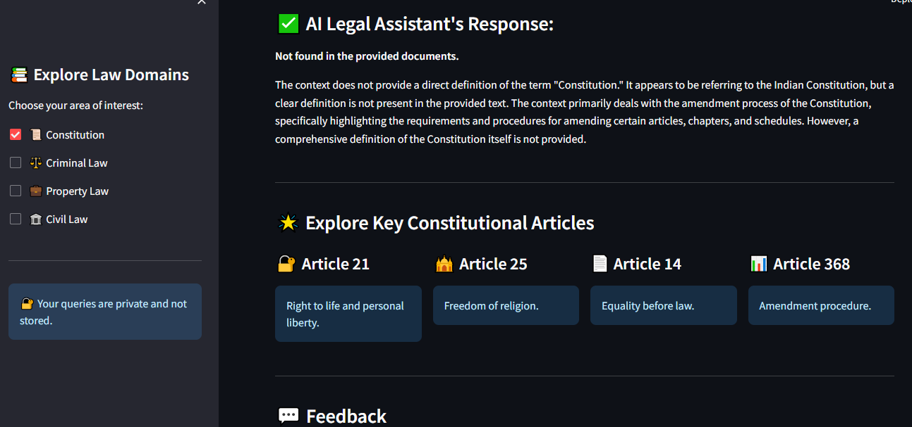

# ⚖️ LawGuide AI – Indian Constitution Legal QA System

A smart legal assistant that answers questions from the **Indian Constitution** using **RAG (Retrieval-Augmented Generation)**.  

Built with LangChain, FAISS, HuggingFace, Groq LLaMA3, and Streamlit.

## 🧠 Features:

- 🔍 **Ask Legal Questions** in natural language

- 📄 **Document-backed answers** with accurate constitutional references

- 🧩 Powered by **FAISS vector search + HuggingFace embeddings**

- 🤖 Uses **Groq's LLaMA3-70B-8192** via LangChain

- 🧾 **Clear, structured, and non-speculative responses**

- 📖 Optional **context viewer** to see which document chunks were used

- 🧠 **Prompt-engineered** to avoid hallucination & mislabeling of Articles

- 🌐 **Simple Streamlit UI** with sidebar filters and article highlights

## 📸 Result images:

## 🚀 How It Works:

### 1. Document Ingestion:

- 4 constitutional PDF files stored in the `data/` folder

- Loaded using `PyPDFLoader`

- Split into overlapping chunks using `RecursiveCharacterTextSplitter`

### 2. Embedding & Vector DB:

- Embedding Model: `sentence-transformers/multi-qa-mpnet-base-dot-v1`

- Indexed using `FAISS` and stored locally in `vector_db_1/`

### 3. RAG Pipeline (Query Phase):

- Embedding Model: `sentence-transformers/all-mpnet-base-v2`

- Retrieval: Top-4 similar chunks (`k=4`) chosen after testing for best accuracy

- Language Model: `Groq’s LLaMA3-70B-8192`

- Response generated only from retrieved context using a **structured legal prompt**

### 4. Frontend:

Streamlit app with:

- 🧾 Text input for questions

- 🔎 Toggle for showing retrieved chunks

- 💬 Feedback section

- 📚 Sidebar filters for law categories

## ▶️ How to Run:

### 1. Clone the repo

- git clone https://github.com/Shiva-Prasad-Naroju/LawSpeaks.git

- cd LawSpeaks

### 2. Install dependencies

- pip install -r requirements.txt

### 3. Set your Groq API key in .env

- GROQ_API_KEY= past_the_api_key_here

### 4. Create vector DB (only once)

- python main.py (this creates vector_db_1)

### 5. Launch the app

- streamlit run app.py

## 🛡️ Limitations:

- Only answers based on the documents loaded.

- Returns: "Not found in the provided documents." if info is missing.

- No live access to external databases or court rulings.

## Tools Used:

- 🧠 LangChain

- ⚙️ FAISS

- 🔤 HuggingFace Transformers

- 🚀 Groq LLaMA3-70B

- 🌐 Streamlit

- 📚 Indian Constitution PDFs

## 📬 Feedback:

Have suggestions or legal topics you'd like added?

Drop your thoughts in the feedback section of the app or open an issue.
